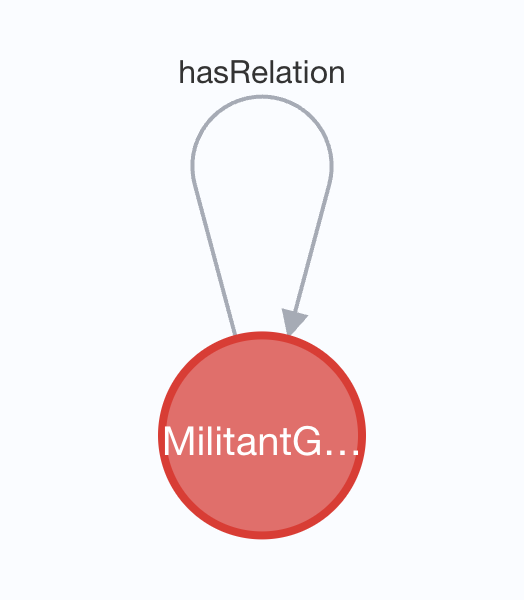
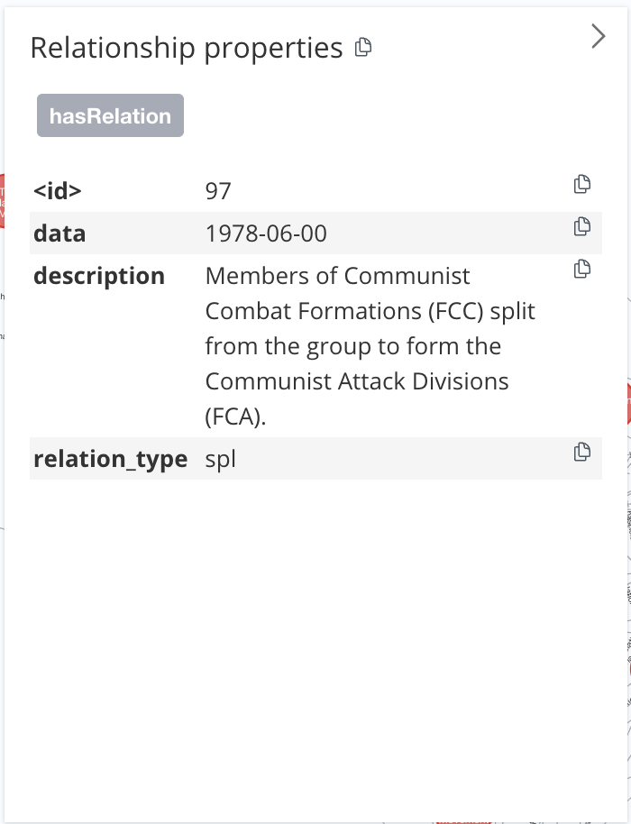
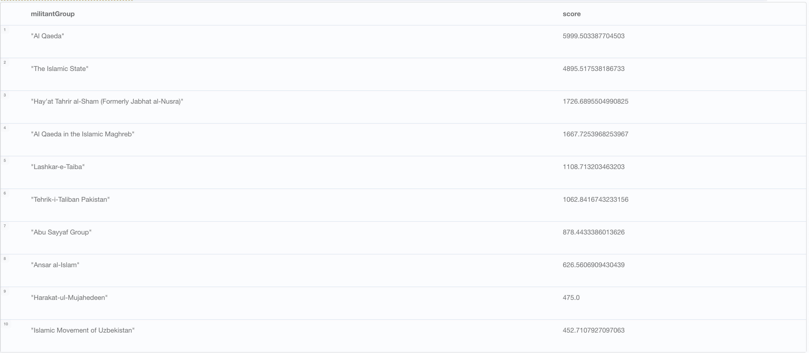
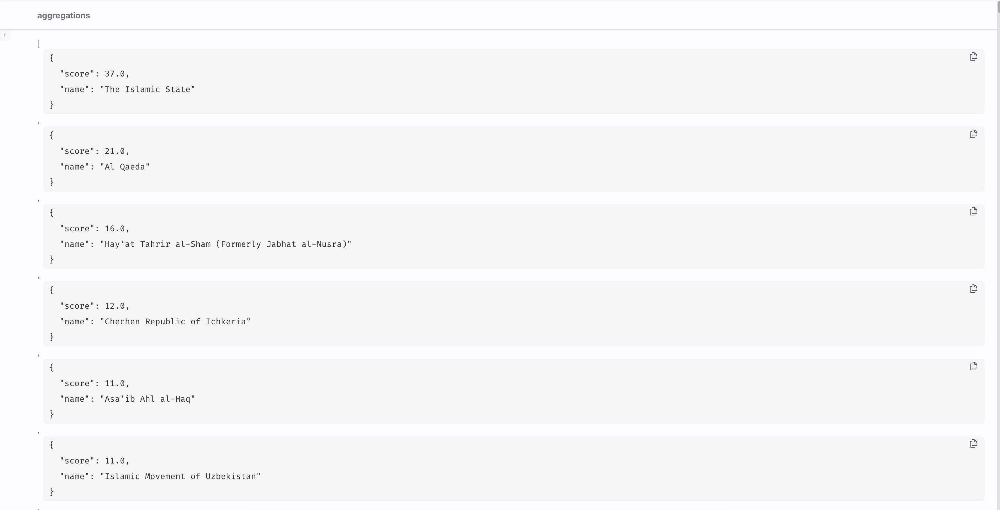
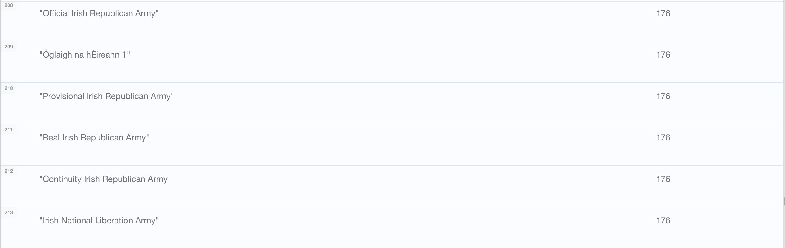
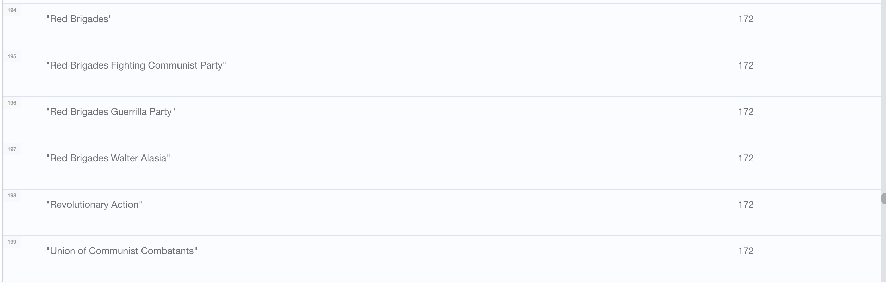
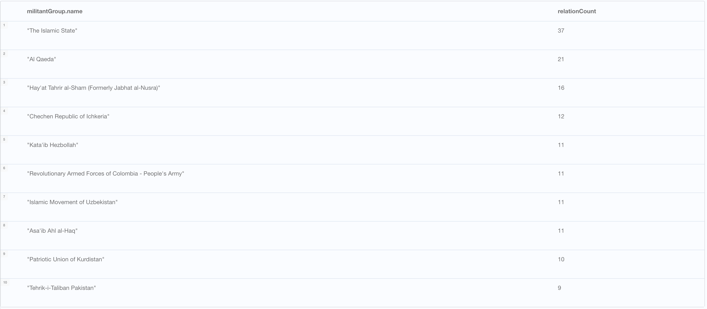
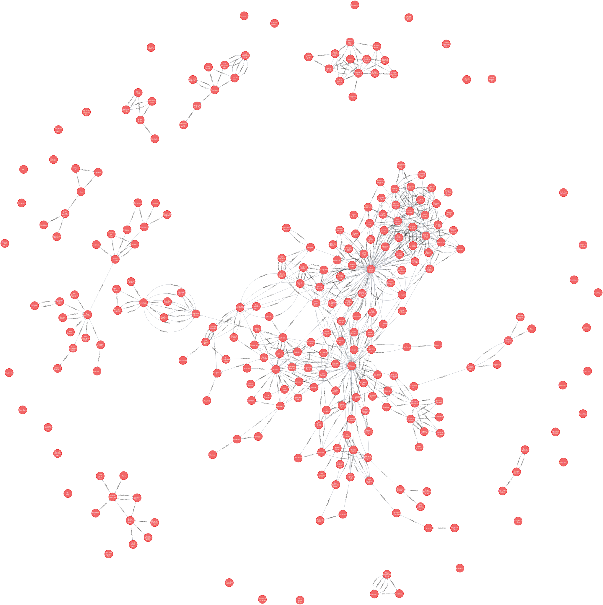
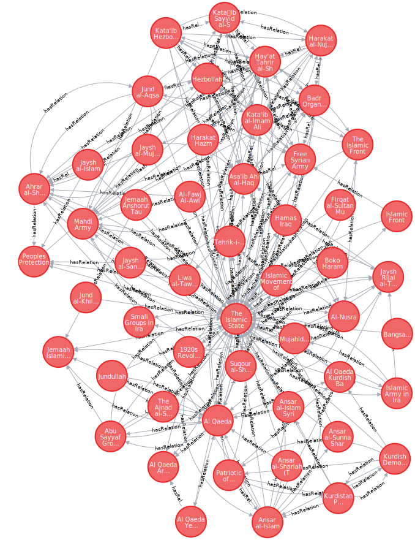

# Militant Map Knowledge Graph

Stanford's Militant Mapping Project in Neo4j

## Data Model

The LPG data model is used to represent the different militant groups. Relations between groups are represented by edges, which in turn have a property based on the date the relation is relevant for and the context of the relation.

Militant groups are represented by nodes of type `MilitantGroup` and are connected to other groups though relationships which hold the bulk of the data, shown below.





## Data

The data from MMP isn't in an analysis-ready format (invalid csv formats, duplicate data) and required extensive cleaning. The cleaned data files used by this project can be found in the `data/` folder.

## Creating the Knowledge Graph

1. Create a new Neo4j project running 5.10.0.
2. Copy the data out of `data/` to the import directory
3. Load the militant groups into the graph with

```CYPHER
LOAD CSV with headers FROM 'file:///Militant Group Key.csv' as row
CREATE (:MilitantGroup {name: row.name, group_id: row.group_id})
```

4. Add the relations between groups

```CYPHER
LOAD CSV WITH HEADERS FROM 'file:///Militant-Group-Relationships-clean.csv' as row
MATCH (group1:MilitantGroup {group_id:row.group1_id}), (group2:MilitantGroup {group_id:row.group2_id})
CREATE (group1)-[r:hasRelation]->(group2)
SET r.date=row.date, r.description=row.description, r.relation_type=row.type
```

## Network Analysis

A few interesting things can be seen from this small dataset.

Neo4j's graph data science library requires a graph projection of the existing graph. To create the projection,

```CYPHER
CALL gds.graph.project('militant-projection', 'MilitantGroup', 'hasRelation')
```

### Centrality

High centrality can be summarized as groups that have many relations (alliances or enemies) to others.

Low centrality groups on the other hand have fewer relations to others and thus may be less important to the larger terror topology.

#### Betweenness

In this context, betweenness is used to determine influential nodes based based on how critical they are w.r.t connecting other nodes. Whether the connections are alliances or enemies is ignored in this analysis.

```CYPHER
CALL gds.betweenness.stream('militant-projection') YIELD nodeId, score
MATCH (militantGroup:MilitantGroup) WHERE id(militantGroup) = nodeId
RETURN militantGroup.name AS militantGroup,score
ORDER BY score DESC LIMIT 10;
```



### Community Detection

The underlying goals of terrorist organizations vary group to group, with groups having similar goals being more connected. For example, the Irish National Liberation Army is connected to several groups concerned with the people of Ireland and shares no connection with those concerned with terror efforts in the Middle East.

Community detection helps make sense of coalitions and identify potential factions with similar underlying goals.

#### Local Clustering Coefficient

This measure of community detection is used to find "good" entry points to a community. This was run on the entire dataset, which explains the skew for Middle East based groups.

```CYPHER
CALL gds.degree.stream('militant-projection') YIELD nodeId, score
MATCH (group:MilitantGroup) WHERE id(group)=nodeId
WITH group, score
ORDER BY score DESC
WITH COLLECT({name: group.name, score: score}) as aggregations
RETURN aggregations
```



#### Louvain method

The Louvain is capable of classifying nodes into different detected communities.

```CYPHER
CALL gds.louvain.stream('militant-projection')
YIELD nodeId, communityId, intermediateCommunityIds
RETURN gds.util.asNode(nodeId).name AS name, communityId
ORDER BY communityId
```

The image below shows successful detection of militant groups concerned with Ireland.



The image below shows successful detection of militant groups concerned with militant groups from the soviet area.




## Misc CYPHER Queries

There are several interesting queries and visuals that can obtained from vanilla CYPHER queries. The images below can be zoomed in if opened in a new tab.

### View highest connected groups

```CYPHER
MATCH (militantGroup)-[r:hasRelation]->(b)
with militantGroup, count(r) as relationCount
ORDER BY (relationCount) DESC LIMIT 10
return militantGroup.name, relationCount
```



### View all Groups & Relations

```CYPHER
MATCH(nodes) return (nodes)
```



### Query Relations to the Islamic State

```CYPHER
match(ISIS {name: 'The Islamic State'})-[:hasRelation]-(Range) return ISIS, Range
```


